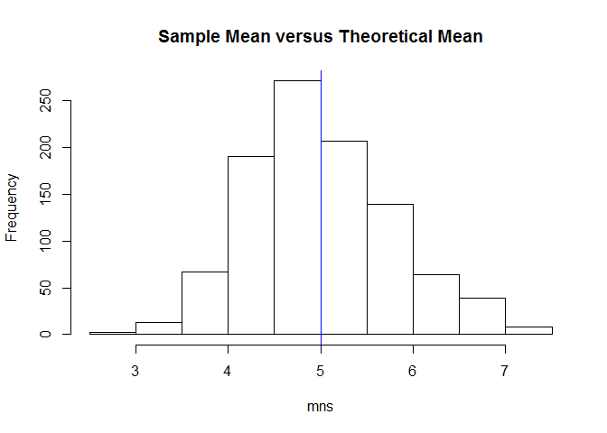
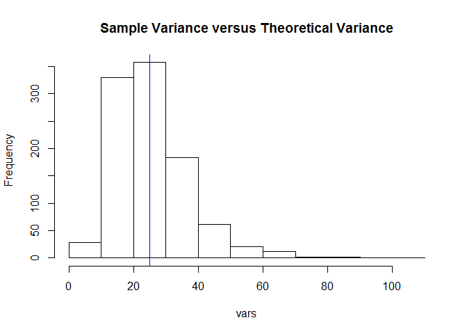
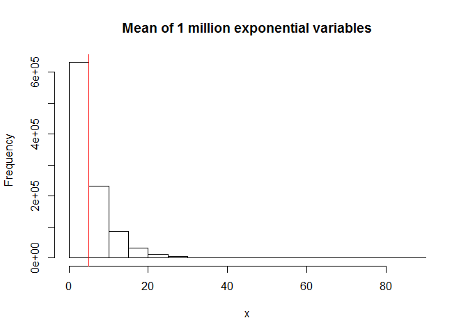
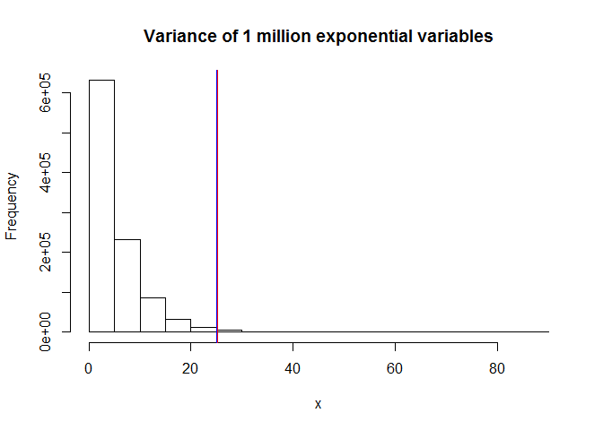

# Statistical Inference Project 1
Yasneen Ashroff  
July 11, 2016  

# Overview
Investigate the exponential distribution in R and compare it with the Central Limit Theorem. 

Illustrate via simulation and associated explanatory text the properties of the distribution of the mean of 40 exponentials. You should

Show the sample mean and compare it to the theoretical mean of the distribution.
Show how variable the sample is (via variance) and compare it to the theoretical variance of the distribution.
Show that the distribution is approximately normal. Focus on the difference between the distribution of a large collection of random exponentials and the distribution of a large collection of averages of 40 exponentials.

The exponential distribution can be simulated in R with rexp(n, lambda) where lambda is the rate parameter. The mean of exponential distribution is 1/lambda and the standard deviation is also 1/lambda. Set lambda = 0.2 for all of the simulations. You will investigate the distribution of averages of 40 exponentials. Note that you will need to do a thousand simulations.


# Simulations
We set lambda (rate) to 0.2 for all simulations.  Also fix the constants declaring theoretical mean and variance. 

```r
lambda=0.2
TheoreticalMean=1/lambda
TheoreticalVariance=(1/lambda)^2

TheoreticalMean
```

```
## [1] 5
```

```r
TheoreticalVariance
```

```
## [1] 25
```
Theoretical mean is 5 and theoretical variance is 25.

Then I simulated 1000 means of 40 random exponential variables. We can see the mean appears Gaussian, and is centered around 5, the theoretical mean, marked with a blue line.

```r
mns = NULL
for (i in 1 : 1000) mns = c(mns, mean(rexp(40,rate=lambda)))
hist(mns,main="Sample Mean versus Theoretical Mean")
abline(v=TheoreticalMean,col="blue")
```

<!-- -->

Next we simulate the variances of 40 random exponential variables. We can see the variance also looks Gaussian, and is centered around 25, the theoretical variance.


```r
vars = NULL
for (i in 1 : 1000) vars = c(vars, var(rexp(40,rate=lambda)))
hist(vars,main="Sample Variance versus Theoretical Variance")
abline(v=TheoreticalVariance,col="blue")
```

<!-- -->

Let's look at 1,000,000 random exponential variables. 

```r
x<-rexp(1000000,rate=lambda)
mean(x)
```

```
## [1] 4.995526
```
Sample mean is nearly 5.

The blue line indicates the theoretical mean and the red line indicates the sample mean. They are extremely close to each other.

```r
hist(x,main="Mean of 1 million exponential variables")
abline(v=TheoreticalMean,col="blue")
abline(v=mean(x),col="red")
```

<!-- -->

Now lets look at the sample's variance compared to theoretical variance (blue vs red lines). They are nearly identical.

```r
hist(x,main="Variance of 1 million exponential variables")
abline(v=TheoreticalVariance,col="blue")
abline(v=var(x),col="red")
```

<!-- -->
