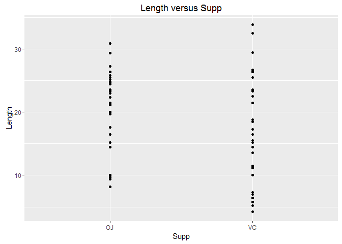
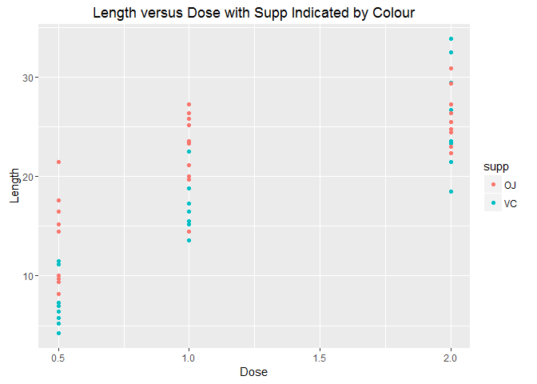

# statistical Inference Final Project
Yasneen Ashroff  
July 11, 2016  

# Overview

Load the ToothGrowth data and perform some basic exploratory data analyses. 
* Provide a basic summary of the data.
* Use confidence intervals and/or hypothesis tests to compare tooth growth by supp and dose. 

# My Assumptions: 
Assume the underlying data is normally distributed and that the sample is representative of the population. Also assume the guinea pigs were randomized.

# My Steps:

## Load/summarize the data

```r
library(ggplot2)
data("ToothGrowth")
summary(ToothGrowth)
```

```
##       len        supp         dose      
##  Min.   : 4.20   OJ:30   Min.   :0.500  
##  1st Qu.:13.07   VC:30   1st Qu.:0.500  
##  Median :19.25           Median :1.000  
##  Mean   :18.81           Mean   :1.167  
##  3rd Qu.:25.27           3rd Qu.:2.000  
##  Max.   :33.90           Max.   :2.000
```

```r
str(ToothGrowth)
```

```
## 'data.frame':	60 obs. of  3 variables:
##  $ len : num  4.2 11.5 7.3 5.8 6.4 10 11.2 11.2 5.2 7 ...
##  $ supp: Factor w/ 2 levels "OJ","VC": 2 2 2 2 2 2 2 2 2 2 ...
##  $ dose: num  0.5 0.5 0.5 0.5 0.5 0.5 0.5 0.5 0.5 0.5 ...
```
We can see from the above that there are 60 observations and that supp has 2 possible values (OJ or VC) while dose has 3 possible values (0.5, 1.0 and 2.0). 

Check how length varies with dose and supp. 

```r
ggplot (aes(x=supp, y = len), data = ToothGrowth) + 
      ggtitle ("Length versus Dose") +labs(x="Dose", y="Length") +geom_point()
```

<!-- -->

```r
ggplot (aes(x=supp, y = len), data = ToothGrowth) + 
      ggtitle ("Length versus Supp") +labs(x="Supp", y="Length") + geom_point()
```

<!-- -->
Lengths are higher with larger doses. Investigate how length varies by dose with Supp indicated by colour:

```r
ggplot (aes(x=dose, y = len), data = ToothGrowth) + 
    geom_point(aes(color = supp)) + ggtitle ("Length versus Dose with Supp Indicated by Colour") +labs(x="Dose", y="Length")
```

<!-- -->

It appears that length is affected by both dose and supp. First, test the alternate hypothesis that supp affects tooth length.

## Use confidence intervals to compare tooth growth by supp

Create independent group T interval to compare the 2 values of Supp (OJ and VC).

```r
g1<-ToothGrowth[ToothGrowth$supp=="VC","len"]
g2<-ToothGrowth[ToothGrowth$supp=="OJ","len"]
```


Run t.test. Since we are assuming the guinea pigs were randomized, we can assume equal variances.

```r
t.test(g1,g2,paired=FALSE,var.equal=TRUE)$conf
```

```
## [1] -7.5670064  0.1670064
## attr(,"conf.level")
## [1] 0.95
```
So the difference in length between OJ and VC is between these 2 values. Since 0 is in this interval, we cannot rule out the possibility that there's no difference between OJ and VC, ie we cannot reject the null hypothesis.

Next we test the alternate hypothesis that dose affects tooth length.

## Use confidence intervals to compare tooth growth for different doses.


```r
g1<-ToothGrowth[ToothGrowth$dose==0.5,"len"]
g2<-ToothGrowth[ToothGrowth$dose==1.0,"len"]
g3<-ToothGrowth[ToothGrowth$dose==2.0,"len"]
```

Use a t-test to look for a correlation in average length between dose=0.5 and dose=1.0. 


```r
t.test(g2,g1,paired=FALSE,var.equal=TRUE)$conf
```

```
## [1]  6.276252 11.983748
## attr(,"conf.level")
## [1] 0.95
```

Use a t-test to look for a correlation in average length between dose=1.0 and dose=2.0

```r
t.test(g3,g2,paired=FALSE,var.equal=TRUE)$conf
```

```
## [1] 3.735613 8.994387
## attr(,"conf.level")
## [1] 0.95
```

We can see that there is a correlation between the tooth length and the dosage for both intervals (0.5 to 1.0 and 1.0 to 2.0), so we can accept the alternate hypothesis that dose affects tooth length.
